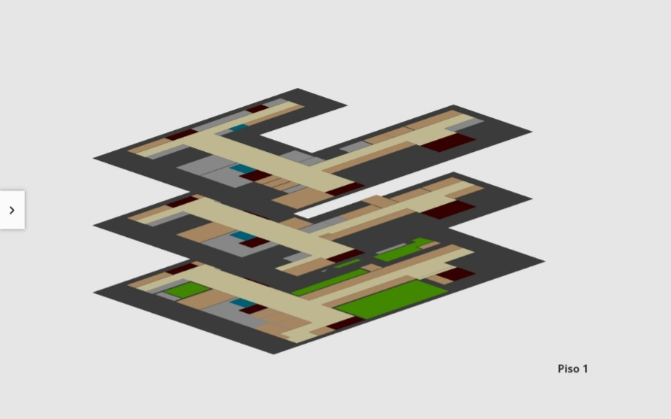
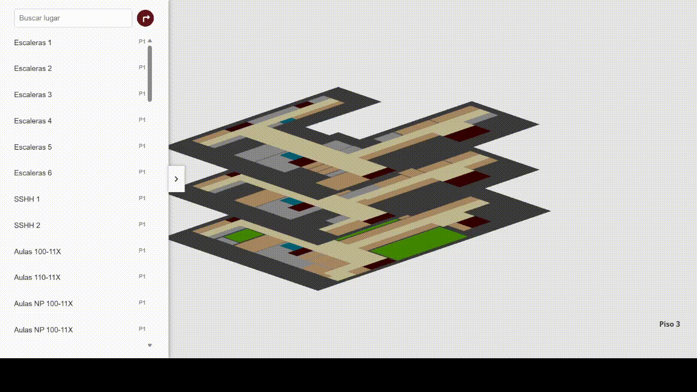
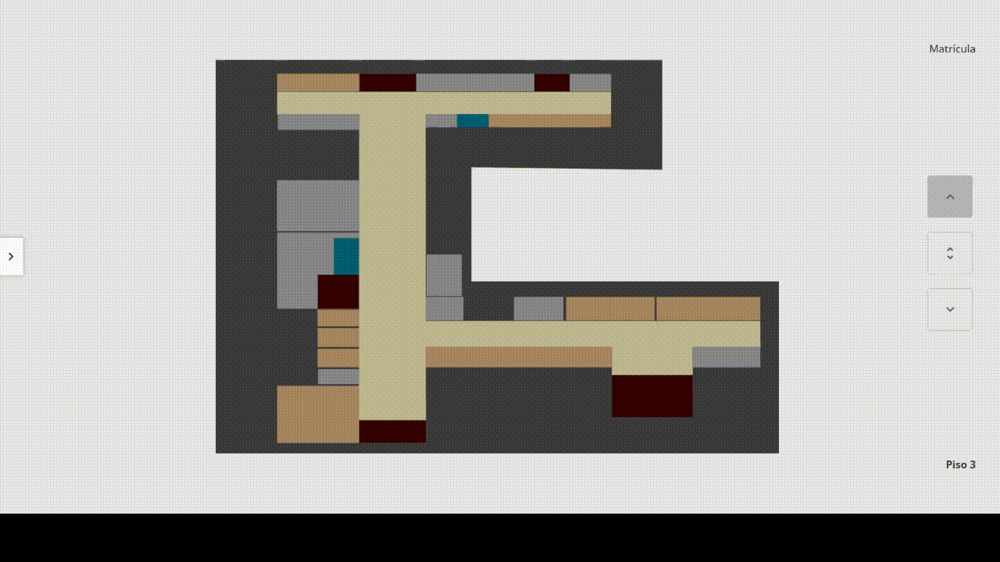
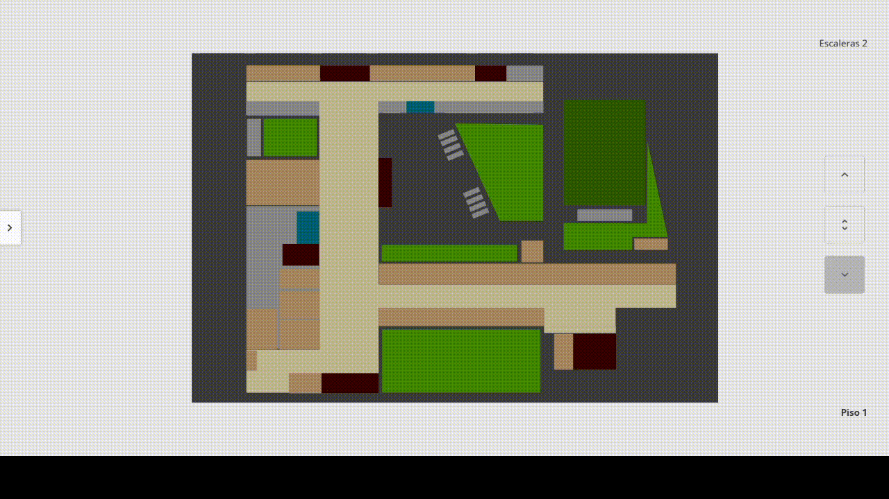
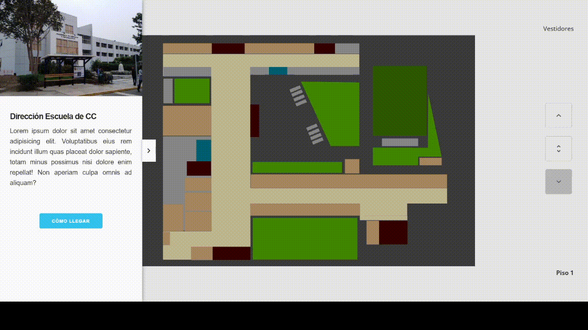
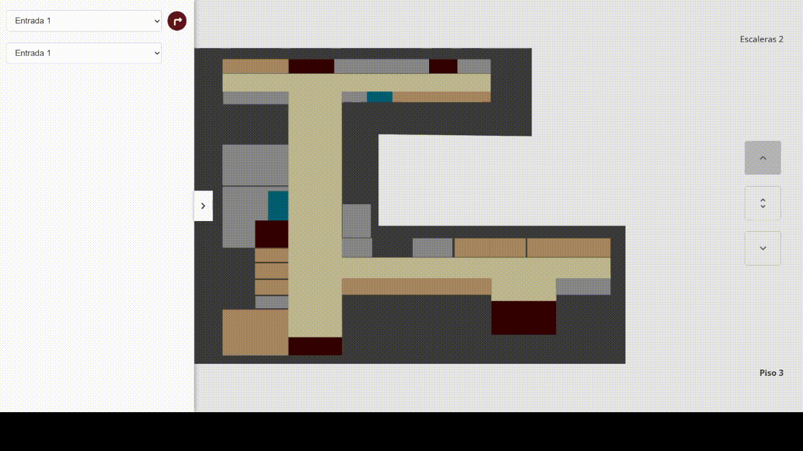
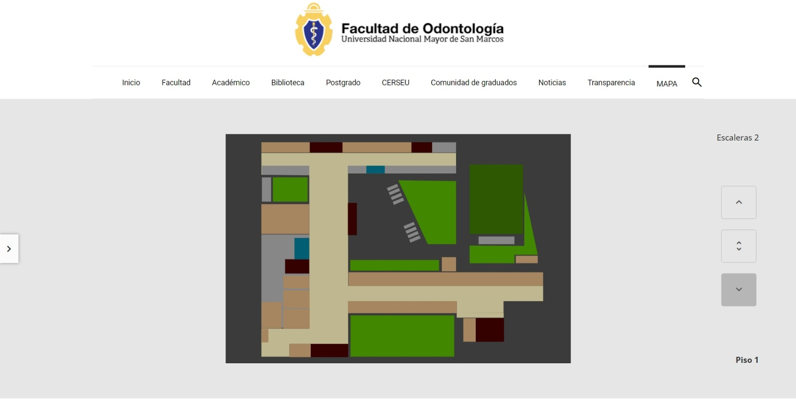
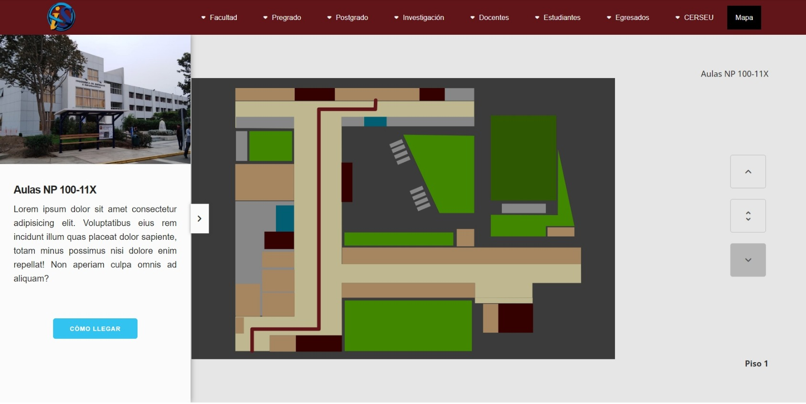
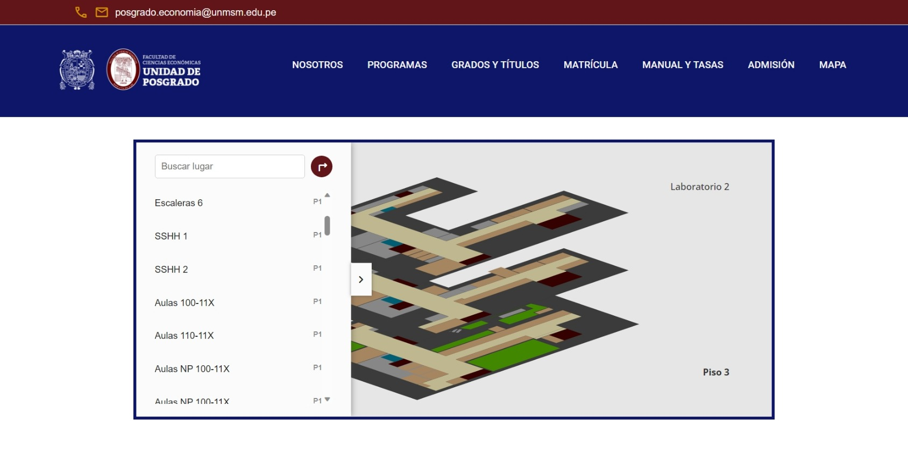

# FISIMAP
Una solución práctica a un problema de la facultad

## Características

### Botones de navegación entre pisos

### Barra lateral de todos los lugares 

### Nombre de cada lugar (Hover)

### Barra lateral de información de cada lugar (Click)

### Botón de cómo llegar al lugar seleccionado

### Recorrido a partir de 2 puntos diferentes
> Navegación entre lugares del mismo piso

> Navegación entre lugares de diferente piso

### Implementación en otras webs

## Integrantes

* Anton Guerrero Edwin Martin
* Condezo Vargas, Kevin Anjelo
* Tarrillo Soto, Gibran Leoncio
* Mejia Caicedo, Carlos Antonio
